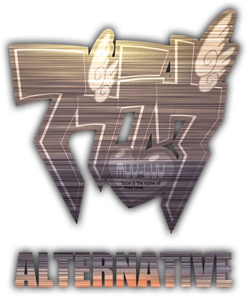

# Alternative4

## 📖 概要 (Overview)

本作は、地上と空中を自在に駆け巡るロボットを操り、無限に迫りくる敵を撃破していく3Dアクションサバイバルゲームです。

プレイヤーは「剣」による近接攻撃と、「銃」による遠距離射撃を状況に合わせて使い分け、四方から迫る敵の群れをなぎ倒していきます。立体的な機動と爽快な戦闘システムを組み合わせた、やりごたえのあるアクション体験を目指しています。

## ✨ 主な特徴 (Features)

- **立体的な機動システム**
  - 重力下での地上移動（歩行・ジャンプ）と、ホバリングによる空中移動をシームレスに切り替え可能。
- **2つの攻撃スタイル**
  - **剣 (Melee):** 接近戦での強力な斬撃アクション。
  - **銃 (Ranged):** 距離を取って敵を狙い撃つシューティング要素。

## 🛠 開発環境 (Tech Stack)

- **Game Engine:** Unity 5
- **Programming Language:** C#
- **3D Modeling:** Fusion

## 👥 開発チーム (Team)

- **Team Asaka** ## 🚀 今後の実装予定 (To-Do)

* [ ] プレイヤーロボットの基本モーション（歩行・ジャンプ・ホバー）の実装
* [ ] 剣と銃の攻撃判定とエフェクトの追加
* [ ] エネミースポーンシステム（無限湧き処理）の構築
* [ ] スコア・残弾数などのUI実装
